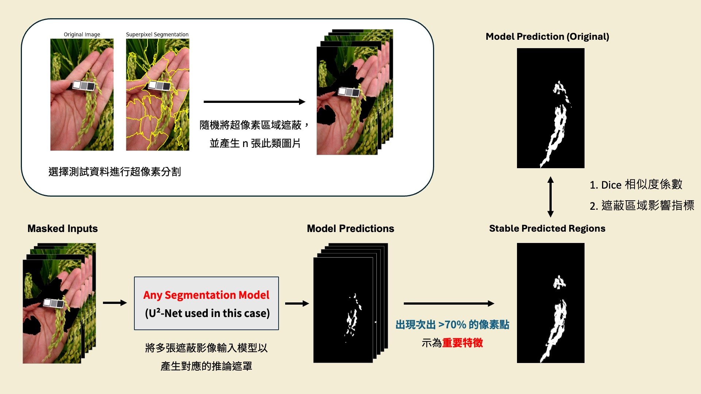

# 多輪超像素遮蔽敏感度量化方法

制定 AI 模型區域敏感性分析方法：首先，透過 SLIC 演算法將輸入影像分割為多個超像素；隨後，在多輪實驗中針對不同遮蔽數量，隨機選取並以黑色替換這些區域，對每張遮蔽後圖像執行模型推論；接著，統計每次推論結果中各像素被標為目標的頻率，並以設定閾值篩選出高頻出現區域；最後，將這些高頻區域可視化並與單次原始輸出比較，量化模型對各影像區域的依賴度與不確定性，以輔助模型優化與驗證。

雲端位置（含簡報、模型權重）：[link](https://drive.google.com/drive/folders/1HD95KQxoi6Tm9niyHj-OHGBywWyqWUhe?usp=sharing)

---

## 方法概覽



本方法以稻穗影像分割模型（U²-Net）為例，透過以下步驟量化模型對各影像區域的依賴程度：

1. **超像素分割**：使用 SLIC 演算法將圖像切割成 n 個超像素區塊
2. **多輪隨機遮蔽**：每輪隨機選取 k 個超像素，以黑色像素遮蔽，共產生 N 張遮蔽圖像
3. **模型批量推論**：將 N 張遮蔽圖像送入分割模型，取得對應的預測遮罩
4. **頻率統計與篩選**：統計每個像素在 N 次推論中被預測為目標的次數，以閾值（預設 70%）篩選出穩定出現的區域，生成 `final_mask`
5. **量化評估**：計算 DSC 與 MIS 兩項指標，量化模型穩定性與區域依賴性

---

## 目錄結構

```
多輪超像素遮蔽敏感度量化方法/
├── extract.ipynb          # Step 1：對原始圖像推論，取得基線預測結果
├── LIME_extract.ipynb     # Step 2：多輪超像素遮蔽 + 頻率統計 + 生成 final_mask
├── evaluate.ipynb         # Step 3：計算 DSC 與 MIS 量化指標
├── images/                # 輸入測試圖像
├── model/
│   └── weight/            # U²-Net 模型權重（需從雲端下載）
├── modules/
│   └── dataset.py         # 自定義資料集（RescaleT、ToTensorLab、CustomDataset）
├── results/               # extract.ipynb 輸出
│   ├── prediction_1.png   # 原始預測二值遮罩
│   └── segmentation_1.png # 去背結果
└── xai_results/           # LIME_extract.ipynb 輸出
    ├── masks/             # 各輪遮蔽後圖像
    ├── predictions/       # 各遮蔽圖對應的模型輸出
    ├── final_mask.png     # 高頻穩定區域遮罩（>70%）
    └── feature_important.png  # final_mask 疊加原圖結果
```

---

## 執行步驟

### Step 1：取得基線預測（`extract.ipynb`）

對原始測試圖像進行 U²-Net 去背推論，取得未遮蔽時的模型輸出作為基準：

```python
model = U2NET(in_ch=3, out_ch=1)
model.load_state_dict(torch.load('model/weight/u2net_rice_panicle_image_extract.pth'))
```

輸出結果儲存至 `results/`：
- `prediction_1.png`：二值預測遮罩
- `segmentation_1.png`：去背疊圖結果

### Step 2：多輪遮蔽分析（`LIME_extract.ipynb`）

使用 SLIC 進行超像素分割後，呼叫 `multi_mask_image()` 產生多張遮蔽圖，並批量送入模型推論：

```python
from skimage.segmentation import slic

# 超像素分割（25 個超像素）
segments = slic(rgb_img, n_segments=25, compactness=20)

# 產生 100 張遮蔽圖，每張隨機遮蔽 5 個超像素
masked_result = multi_mask_image(
    image=rgb_img,
    segments=segments,
    mask_num=5,      # 每張遮蔽的超像素數量
    output_num=100   # 產生遮蔽圖總數
)

# 統計頻率，以 70% 為閾值生成 final_mask
threshold = 0.7
final_mask = (pixel_threshold <= np.sum(binary_masks, axis=0)).astype(np.uint8) * 255
```

### Step 3：量化評估（`evaluate.ipynb`）

計算兩項量化指標：

**1. Dice 相似度係數（DSC）**

衡量 `final_mask` 與原始 `prediction` 的相似程度：

$$DSC = \frac{2 \times |final\_mask \cap prediction|}{|final\_mask| + |prediction|}$$

| 數值範圍 | 解讀 |
|----------|------|
| 接近 1 | `final_mask` 與原始預測高度一致，模型輸出穩定 |
| 低於 0.5 | 可解釋性結果與原始預測差異大，模型不穩定 |

> 範例結果：DSC = **0.9285**

**2. 遮蔽區域影響指標（MIS）**

評估模型輸出受超像素遮蔽的敏感程度：

$$MIS = 1 - \frac{\sum_{i=1}^{N} IoU(O, O_i)}{N}$$

| 數值範圍 | 解讀 |
|----------|------|
| 接近 0 | 模型對各超像素遮蔽不敏感，預測穩定 |
| 接近 1 | 模型對特定區域遮蔽高度敏感，存在強依賴 |

> 範例結果：MIS = **0.2755**

---

## 環境需求

```bash
pip install torch torchvision
pip install opencv-python matplotlib numpy pillow
pip install scikit-image lime
```

模型權重需從雲端下載後放置於：

```
model/weight/u2net_rice_panicle_image_extract.pth
```

---

## 關鍵技術

| 技術 | 說明 |
|------|------|
| SLIC 超像素分割 | `skimage.segmentation.slic`，將影像切割為語義一致的區塊 |
| U²-Net | 雙巢狀 U 型網路，適用於顯著性物件偵測與去背任務 |
| LIME 遮蔽策略 | 參考 LIME（Local Interpretable Model-agnostic Explanations）的影像解釋思路 |
| 頻率閾值篩選 | 統計多輪推論中各像素被預測為目標的機率，以此量化模型對該區域的依賴程度 |

---

## 注意事項

- 模型權重（`u2net_rice_panicle_image_extract.pth`）需從雲端下載後放置於 `model/weight/`，首次執行前請確認路徑正確
- SLIC 參數（`n_segments`、`compactness`）可依圖像解析度與場景複雜度調整，超像素數量越多細節越豐富但計算量越大
- 遮蔽輪數（`output_num`）越高統計結果越穩定，但推論時間等比例增加，建議至少 50 輪以上
- 完整技術細節與範例可參考雲端簡報
